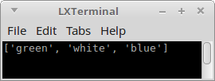
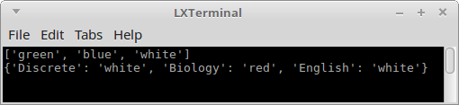

# Extra Credit - Structures

In Chapter 5.1, we had a question about students choosing folders for
their three classes. There were four total folder colors:
**white, green, red, and blue**, and three different classes;
**English, Discrete Structures, and Biology**.

Four students chose their folders as such:

* Uryiah selected folders in an **unordered** manner: Grabbed 3 folders without
    consideration for color.
* Orlando selected folders in an **ordered** manner: Grabbing a folder first
    for English, second for Discrete Structures, and third for Biology.
* Connie selected folders in a **combination**: She chose folders of 3 different colors,
    but in no particular order.
* Pete selected a **permutation**: He chose 3 different colors, like Connie,
    and he also selected them in order like Orlando.

In this extra credit exercise, we will generate a randomized list of folders
that obey the rules above. We will use Python and step through the code a bit
at a time. You can also do this assignment in a different language.

## Starter code

```python
# Uryiah: Grabbed 3 folders without consideration for color.
# Orlando: Chose folders in order: English, then Discrete Structures, then Biology.
# Connie: 3 different colored folders, doesn't matter what colors.
# Pete: Chose in order like Orlando and different colors like Connie.

import random

def Unordered_Uryiah( data ):
    print( "Placeholder" )
    return []


def Ordered_Orlando( data ):
    print( "Placeholder" )
    return []


def Combination_Connie( data ):
    print( "Placeholder" )
    return []


def Permutation_Pete( data ):
    print( "Placeholder" )
    return []


unordered_list = Unordered_Uryiah( [ "white", "green", "red", "blue" ] )
print( unordered_list )

ordered_list = Ordered_Orlando( [ "white", "green", "red", "blue" ] )
print( ordered_list )

combination_list = Combination_Connie( [ "white", "green", "red", "blue" ] )
print( combination_list )

permutation_list = Permutation_Pete( [ "white", "green", "red", "blue" ] )
print( permutation_list )
```

Right now when you run this, each person will have an empty list of folders.
We will update the functions to assign their folders, using the data passed in -
the list of folder colors.

## 1. Unordered_Uryiah

For Uryiah, three folders will be chosen in any order, and any colors.
Duplicates are allowed. This is essentially just selecting three folders at random.

First, start off by creating a Python list like this:

```python
uList = []
```

then, we can write a loop to run 3 times, select a random folder index,
and append it to our ```uList```.

**Remember that internal codeblocks MUST be indented forward one level in Python!**

```python
def Unordered_Uryiah( data ):           # Function definition
    uList = []                          # Creating an empty list
    
    for i in range( 0, 3 ):             # For loop from i = 0 to 3
        d = random.randint( 0, 3 )      # Choose a random number between 0 and 3
        uList.append( data[d] )         # Append item #d from the data list to the uList
    
    return uList                        # Return the uList once done
```

Once you run the program, you should get 3 random selections each time:



---


## 2. Ordered_Orlando

For Orlando, he selected his items in a specific order: First English,
then Discrete Structures, then Biology.

In Python, we also have a **dictionary** structure that is a key-value type
of list. We can use that here to assign folders to specific school topics.

We can create a new dictionary with:

```python
oList = {}
```

Then, we can assign a value to some key like this...

```python
    a = random.randint( 0, 3 )
    oList[ "English" ] =  data[a]
```

For this list, make sure to assign a random folder for "Discrete" and "Biology" as well,
and ```return oList``` at the end of the function.




## 3. Combination_Connie

---

## 4. Permutation_Pete
