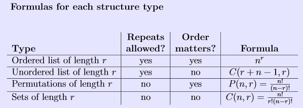

# Chapter 5 Project

Spring 2018

## About

For this project, you will use any programming language that you're comfortable with to implement
simple programs that will compute Permutations, Sets, Ordered Lists, and Unordered Lists.

Each of these shouhld be implemented in a function that takes *n* and *r* as input variables, and gives the result as the return value.

## Formulas

For each of these *n* is the amout of choices, and *r* is the amount of items being selected.



* Ordered list: *n<sup>r</sup>*
* Unordered list: *C(r + n - 1, r)*
* Permutation: *P(n, r) = (n!)/(n-r)!*
* Combination: *C(n, r) = (n!)/(r! (n-r)!)*

------

# Math in programming

Most languages require a library to use operations like exponents, and you will have to implement your own factorial function.

## Exponents

**C++**

[Documentation](http://www.cplusplus.com/reference/cmath/pow/)

```c++
#include <cmath>

int main()
{
    // Get 2^3:
    double result = pow( 2, 3 );

    return 0;
}
```

**Python**

[Example](https://www.tutorialspoint.com/python/python_basic_operators.htm)

```python
# get 2^3:

result = 2 ** 3
```

## Factorial

You can implement the factorial function using iteration or recursion.
Here are some examples:

**C++**

```c++
int Factorial( int n )
{
    if ( n == 0 ):
        return 1;
    
    return n * Factorial( n-1 );
}
```

**Python**

```python
def Factorial( n ):
    if ( n == 0 ):
        return 1
    
    return n * Factorial( n-1 )
```

-------

# Pseudocode

```
function Permutation:
    inputs: n (int), r (int)
    return: int
    
    return the value: n! / (n-r)!

function Combination:
    inputs: n (int), r (int)
    return: int
    
    return the value: n! / (r! * (n-r)!)

function OrderedList:
    inputs: n (int), r (int)
    return: int
    
    return the value: n^r

function UnorderedList:
    inputs: n (int), r (int)
    return: int
    
    
    return: Combination( r+n-1, r )
    
function MainProgram:
    quit = False
    
    while quit is not True:
        Display menu to user: 
            1. Permutation, 
            2. Combination, 
            3. Ordered List
            4. Unordered List
            5. Quit
        
        Ask the user what their selection is.
        
        If the user selected 5, quit. Otherwise...
        
        Ask the user for n
        
        Ask the user for r
        
        If the user selected 1, call Permutation and display the result.
        
        If the user selected 2, call Combination and display the result.
        
        If the user selected 3, call Ordered List and display the result.
        
        If the user selected 4, call Unordered List and display the result.
```


